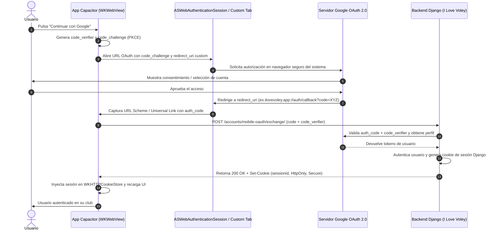

# Registro de Decisión Técnica (ADR): Empaquetado Móvil en I Love Voley (PWA vs Capacitor vs TWA)

**Fecha:** 2026-09-30  
**Estado:** Aprobado (Fase 1: PWA Pura; Hoja de ruta tiendas: TWA Android / Capacitor iOS)  
**Contexto / Issue:** [#227](https://github.com/trencaclosqu3s/ilovevoley/issues/227) (Hija de [#226](https://github.com/trencaclosqu3s/ilovevoley/issues/226))  
**Autores:** Equipo de Arquitectura de I Love Voley  

---

## 1. Resumen Ejecutivo y Decisión de Producto: App Única Comunitaria

### 1.1. Contexto del Problema
I Love Voley es una plataforma multi-tenant desarrollada en Django orientada a la gestión de clubes, competiciones, partidos, plantillas y contenido audiovisual (vídeos e imágenes) de voleibol. Cada club asociado opera bajo un subdominio federado propio (`https://{slug}.ilovevoley.es/`) o dominio personalizado, compartiendo una base de datos centralizada con aislamiento lógico de tenant (`Organization`).

Al abordar la estrategia de presencia en dispositivos móviles de jugadores, entrenadores, directivas y familias, se planteó la disyuntiva entre dos filosofías de distribución:
1. **Modelo de marca blanca fragmentada**: Generar, compilar y publicar una aplicación móvil independiente en las tiendas para cada club asociado (ej. "App Club Sant Josep", "App Club Voley Sóller", etc.).
2. **Modelo de App Única Comunitaria ("I Love Voley")**: Publicar e instalar una única aplicación móvil universal que aglutina la identidad de la plataforma comunitaria y permite el acceso inteligente y conmutación entre los clubes del usuario.

### 1.2. Justificación del Rechazo al Modelo de Marca Blanca
El empaquetado de aplicaciones individuales por club fue **descartado categóricamente** por los siguientes motivos operativos, económicos y técnicos:

1. **Costes de licenciamiento e infraestructura de tiendas**:
   - Apple exige que cada organización titular de marca disponga de su propia cuenta en el *Apple Developer Program* ($99 USD anuales por club) para evitar la infracción de la directriz **4.3 (Spam / Plantillas)** de la App Store, la cual prohíbe explícitamente que un desarrollador suba múltiples aplicaciones basadas en una plantilla idéntica.
   - En Google Play Console, aunque las políticas de plantillas son más tolerantes, la gestión de N fichas de producto, claves de firma (`keystores`), políticas de privacidad y revisiones independientes resulta inmanejable.
2. **Carga de mantenimiento y pipelines de despliegue**:
   - Un cambio en la capa visual o una corrección de seguridad obligaría a recompilar, firmar y enviar a revisión N artefactos binarios (`.aab` y `.ipa`), con tiempos de aprobación asíncronos y fragmentación de versiones en producción.
3. **Fricción para usuarios multi-club**:
   - En el voleibol base y federado es sumamente habitual que entrenadores dirijan equipos en más de un club, o que familias con varios hijos tengan integrantes federados en clubes distintos (como el caso fundacional de Marc entre Sant Josep y Sóller). Obligar a estos usuarios a instalar y alternar entre varias aplicaciones clónicas degrada gravemente la experiencia de usuario.

### 1.3. Decisión de Producto: App Única "I Love Voley"
Se adopta formalmente la arquitectura de **App Única Comunitaria**:

```
                               ┌────────────────────────────────┐
                               │  Instalación Única en Móvil    │
                               │      "I Love Voley"            │
                               │  (Icono oficial y PWA Manifest)│
                               └───────────────┬────────────────┘
                                               │
                                      ¿Usuario autenticado?
                                               │
                         ┌─────────────────────┴─────────────────────┐
                         │ Sí                                        │ No
                         ▼                                           ▼
             Número de Membresías Aprobadas                  ┌───────────────────┐
                         │                                   │ Landing Abierta   │
            ┌────────────┴────────────┐                      │ Catálogo de clubes│
            │ 1                       │ >1                   │ y competiciones   │
            ▼                         ▼                      └───────────────────┘
   ┌──────────────────┐     ┌───────────────────────┐
   │ Redirección 302  │     │ Landing Comunitaria   │
   │ automática a:    │     │ "Tus clubes" arriba   │
   │ {slug}.ilovevoley│     │ Selector en cabecera  │
   └──────────────────┘     └───────────────────────┘
```

1. **Una sola aplicación instalada en el dispositivo**: Nombre `"I Love Voley"`, `short_name: "ILoveVoley"`, con icono representativo oficial (`icon-192.png`, `icon-512.png`, `icon-maskable-512.png`).
2. **Enrutamiento inteligente por membresía**:
   - **Usuario mono-club**: Redirección HTTP 302 inmediata a su tenant (`https://{slug}.ilovevoley.es/`). No experimenta pasos intermedios.
   - **Usuario multi-club**: Permanece en la raíz comunitaria con un panel prioritario en cabecera (**"Tus clubes"**) para acceder con un solo toque a cualquiera de sus entidades aprobadas, disponiendo además del botón "Cambiar de club" en la navegación interna.
   - **Usuario anónimo / nuevo visitante**: Acceso al portal comunitario para consultar competiciones públicas, resultados federativos o solicitar adhesión a su club.
3. **Personalización dinámica in-app**: Cuando el usuario se encuentra dentro del subdominio de un club, el color temático de la barra de estado (`theme-color`), los escudos, las plantillas y el menú adoptan la identidad corporativa del tenant, manteniendo la coherencia de marca del club dentro del contenedor comunitario.
4. **Estrategia evolutiva: PWA primero, tiendas después**:
   - **Fase 1 (Actual)**: PWA web pura estandarizada. Fricción cero, instalación inmediata desde el navegador, coste cero.
   - **Fase 2 (Opcional - Google Play)**: Empaquetado ligero TWA (Trusted Web Activity) con Bubblewrap.
   - **Fase 3 (Opcional - iOS App Store)**: Shell Capacitor enriquecido con capacidades nativas cuando las notificaciones push de iOS o los requerimientos de marketing exijan presencia obligatoria en la tienda de Apple.

---

## 2. Matriz Comparativa: PWA vs Android TWA vs Capacitor

| Criterio | PWA (Progressive Web App) | Android TWA (Trusted Web Activity) | Capacitor Shell (Cross-Platform) |
|---|---|---|---|
| **Plataformas Soportadas** | Universal (Android, iOS, iPadOS, Desktop, macOS, Windows). | Exclusivo de Android (Google Play Store). | iOS (App Store) y Android (Google Play Store). |
| **Canal de Distribución** | Navegador web directo (Añadir a pantalla de inicio / Banner de instalación W3C). | Google Play Store (descarga como app Android nativa `.aab`). | Apple App Store y Google Play Store (binarios `.ipa` y `.aab`). |
| **Fricción de Adopción** | Nula. Sin pasar por tiendas ni descargas pesadas de megabytes. | Baja para el usuario de tienda; requiere búsqueda e instalación estándar. | Baja para el usuario de tienda; requiere búsqueda e instalación estándar. |
| **Costes de Licencia** | **0 €**. No requiere cuentas de desarrollador. | **25 $ USD** (pago único de cuenta Google Play Console). | **99 $ USD/año** (Apple Developer) + **25 $ USD** (Google Play). |
| **Tiempo de Salida (Time to Market)** | **Inmediato**. Disponible en cuanto se despliega el código Django en producción. | **1 a 2 días** (generación con Bubblewrap y revisión en Google Play). | **2 a 4 semanas** (configuración de proyecto nativo, plugins, assets, testing en Xcode y revisión estricta de Apple). |
| **Ciclo de Actualización** | **Instantáneo OTA (Over-The-Air)**. Todo cambio en servidor o templates se refleja al refrescar. | **Instantáneo OTA**. El código se sirve desde el servidor Django; la app en tienda solo actualiza si cambia la configuración de la shell. | Mixto. El contenido web se actualiza desde el servidor, pero cambios en plugins o código nativo requieren nuevo pase de revisión en tiendas. |
| **Google OAuth / Social Login** | **Nativo y transparente**. Se ejecuta en el navegador web estándar sin restricciones. | **Nativo y compartido**. Corre sobre Chrome del sistema; no salta `disallowed_useragent` y reutiliza sesiones activas. | **Complejo**. Las WebViews están bloqueadas por Google. Requiere flujo con `ASWebAuthenticationSession` / Custom Tabs y PKCE. |
| **Aislamiento Multi-Tenant y Cookies** | Óptimo. Comparte el motor del navegador; las cookies de sesión y subdominios funcionan según los estándares web. | Óptimo. Reutiliza el almacén de cookies del Chrome del usuario. | Aislado. `WKWebView` tiene su propio almacén de cookies (`WKHTTPCookieStore`) separado de Safari. |
| **Capacidades de Hardware y SO** | Medias (Cámara vía HTML file input, geolocalización, pantalla completa, Web Share API). | Medias-Altas (Mismas que PWA + integración básica con intents y Digital Asset Links). | **Completas**. Acceso directo a cualquier API nativa de iOS/Android mediante plugins Capacitor o código Swift/Kotlin. |
| **Notificaciones Push** | Soportadas en Android y en iOS 16.4+ (solo si la PWA está instalada en pantalla de inicio). | Soportadas mediante Web Push API estándar o integración Firebase nativa. | **Nativas de primer nivel** (APNs en iOS y FCM en Android con badge de icono y control granular). |
| **Riesgo de Rechazo en Tienda** | **Ninguno** (no depende de la aprobación de Apple ni Google). | **Muy bajo** en Google Play (TWA es un estándar oficialmente promovido por Google). | **Alto en Apple** si no se dota de funcionalidad nativa real (Directriz 4.2: *Minimum Functionality / Thin Wrapper*). |
| **Veredicto I Love Voley** | **Elección v1 (Producción actual)**. Máxima eficiencia y rentabilidad para el alcance actual. | **Recomendada para Fase 2** si se decide publicar en Google Play Store. | **Recomendada para Fase 3** exclusivamente si se aprueba publicar en la App Store de Apple. |

---

## 3. Autenticación Google OAuth en Entornos Móviles

La autenticación mediante Google OAuth 2.0 es uno de los puntos críticos al empaquetar una aplicación web para entornos móviles.

### 3.1. El Bloqueo de `disallowed_useragent`
A partir de la directiva de seguridad establecida por Google (conforme a la recomendación **RFC 8252: OAuth 2.0 for Native Apps**), Google **prohíbe y bloquea explícitamente las peticiones de autenticación OAuth que se originan dentro de WebViews embebidos** (`android.webkit.WebView` en Android y `WKWebView` / `UIWebView` en iOS).

Cuando un usuario intenta iniciar sesión con Google dentro de una WebView estándar, los servidores de Google detectan las cabeceras de user-agent incrustado y abortan la operación con el error:
> **403: disallowed_useragent**  
> *"No puedes iniciar sesión desde esta aplicación porque no cumple la política de navegación segura de Google."*

**Motivo técnico de seguridad:**  
Una WebView incrustada otorga a la aplicación nativa anfitriona control total sobre el árbol DOM, inyección de código JavaScript arbitrario e interceptación de eventos de teclado. Un contenedor malicioso podría leer transparentemente las credenciales de la cuenta Google del usuario o secuestrar los tokens de sesión.

### 3.2. La Falacia de las "Cookies Compartidas"
Un error habitual en desarrollos móviles híbridos es asumir que la WebView incrustada comparte la sesión o las cookies con el navegador predeterminado del sistema (Safari en iOS o Chrome en Android).

- En **iOS**, `WKWebView` opera en un espacio de procesos aislado (`WebKit networking process`) y gestiona su propio `WKHTTPCookieStore`. Safari almacena sus cookies en un silo seguro del sistema al que ninguna aplicación de terceros tiene acceso. Si un usuario ya tiene sesión iniciada en Google en Safari, esa sesión **no existe** dentro de una `WKWebView`.
- En **Android**, `android.webkit.WebView` utiliza su propia instancia de `CookieManager`, completamente desvinculada de la base de datos de cookies de Google Chrome.

### 3.3. Solución en Android vía TWA (Trusted Web Activity)
En la plataforma Android, la arquitectura **TWA resuelve el problema de forma nativa y elegante**:

```
┌────────────────────────────────────────────────────────┐
│             Dispositivo Android (TWA Shell)            │
│                                                        │
│  ┌──────────────────────────────────────────────────┐  │
│  │  Chrome Custom Tabs (Motor Chrome del Sistema)   │  │
│  │  Verificación criptográfica: assetlinks.json     │  │
│  │                                                  │  │
│  │  - User-Agent estándar de Chrome completo        │  │
│  │  - Reutilización de cuentas Google del SO        │  │
│  │  - Sin bloqueo disallowed_useragent              │  │
│  └──────────────────────────────────────────────────┘  │
└────────────────────────────────────────────────────────┘
```

1. **Sin WebViews aisladas**: Una TWA no utiliza `android.webkit.WebView`. En su lugar, delega la renderización directamente a **Chrome Custom Tabs** ejecutado en modo inmersivo a pantalla completa.
2. **Identidad verificada**: Dado que el dominio está vinculado criptográficamente a la aplicación mediante Digital Asset Links (`assetlinks.json`), el sistema operativo reconoce que el navegador y la aplicación son la misma entidad de confianza.
3. **Compatibilidad total con Google OAuth**: Las peticiones de autenticación viajan con el User-Agent genuino del navegador Chrome del sistema. Google permite el flujo sin advertencias, e incluso ofrece inicio de sesión en un clic con las cuentas de Google sincronizadas en el dispositivo Android.

### 3.4. Solución en Capacitor para iOS (y Android sin TWA): Flujo PKCE y Deep Links
Si se empaqueta la aplicación con Capacitor para iOS, la interfaz principal reside en una `WKWebView`. Para autenticar al usuario con Google OAuth sin provocar el error `disallowed_useragent`, es obligatorio implementar el **flujo Authorization Code con PKCE (Proof Key for Code Exchange, RFC 7636)** asistido por navegadores seguros del sistema.



#### Detalles de la Implementación Técnica para Capacitor:
1. **Agente de Autenticación de Sistema**:
   - En **iOS**: Utilizar la API nativa `ASWebAuthenticationSession` (disponible mediante plugins oficiales como `@capacitor/browser` o `@codetrix-studio/capacitor-google-auth`). Esta API presenta una hoja modal segura gestionada por iOS que permite compartir cookies con Safari únicamente bajo consentimiento expreso del usuario, y garantiza que Google detecte un navegador de confianza.
   - En **Android**: Lanzar un *Chrome Custom Tab*.
2. **Esquema de Redirección (Universal Links / Custom Schemes)**:
   - Registrar un esquema de URL propio en el archivo de configuración de Capacitor (`capacitor.config.ts`), por ejemplo: `es.ilovevoley.app://google-auth-callback` o un Universal Link HTTPS verificado (`https://ilovevoley.es/accounts/google/callback/mobile`).
3. **Canje en Backend Django (`/accounts/mobile-oauth/exchange/`)**:
   - El código de autorización recibido no debe canjearse en el cliente por seguridad de los secretos.
   - Se envía mediante un endpoint protegido en Django que intercambia el `code` junto con el `code_verifier` ante Google, autentica o crea el usuario en `django.contrib.auth`, y establece la cookie `sessionid` segura (`SameSite=Lax; Secure; HttpOnly`).
   - El plugin Capacitor sincroniza dicha cookie con el `WKHTTPCookieStore` de la `WKWebView`, quedando la navegación autenticada en todo el tenant.

---

## 4. Pautas para Superar la Directriz 4.2 de Apple ("Minimum Functionality / Thin Wrapper")

### 4.1. Explicación de la Directriz 4.2
La directriz **4.2 (Minimum Functionality)** de las *App Store Review Guidelines* es la principal causa de rechazo para aplicaciones híbridas o empaquetadas con Capacitor/Cordova:
> *"Your app should include features, content, and UI that elevate it beyond a repackaged website. If your app is not particularly useful, unique, or 'app-like,' it doesn't belong on the App Store."*

Apple rechaza de manera fulminante aplicaciones que se limitan a cargar una URL remota dentro de una `WKWebView` sin aportar funcionalidades de hardware o comportamientos nativos específicos que justifiquen su presencia en la tienda en lugar de consumirse vía Safari.

### 4.2. Lista de Capacidades Nativas Obligatorias si se Compila con Capacitor
Para garantizar la aprobación en la App Store, la versión Capacitor de I Love Voley **debe incorporar valor diferencial nativo** en las siguientes áreas:

#### 1. Notificaciones Push Nativas Integradas con APNs (Apple Push Notification service)
- **Caso de uso de producto**:
  - Alertas instantáneas de cambio de pabellón o modificación de hora de un partido de la liga federada.
  - Avisos en directo de resultados finales de los equipos seguidos por el usuario.
  - Notificaciones de publicación de nuevos álbumes de fotos o vídeos del partido del fin de semana.
- **Implementación técnica**:
  - Plugin `@capacitor/push-notifications`.
  - Integración en Django mediante servicio de envío de notificaciones (vía Firebase Cloud Messaging v1 con credenciales APNs para iOS).

#### 2. Acceso Nativo a Hardware de Captura (Cámara y Fotos)
- **Caso de uso de producto**:
  - Subida directa de actas oficiales de partido por parte de entrenadores y delegados de campo.
  - Carga masiva de fotografías a álbumes de equipo desde el carrete nativo de iOS.
- **Implementación técnica**:
  - Plugin `@capacitor/camera`.
  - Compresión local de imágenes en cliente (conversión a WebP/JPEG optimizado) antes del upload multipart a Django, reduciendo el consumo de datos móviles en pabellones deportivos.

#### 3. Soporte para Compartición Nativa (Native Share Sheet)
- **Caso de uso de producto**:
  - Compartir resúmenes de partidos, clasificaciones de liga o enlaces a jugadas de vídeo directamente hacia WhatsApp, Telegram o historias de Instagram mediante la hoja de compartir nativa de iOS.
- **Implementación técnica**:
  - Plugin `@capacitor/share`.

#### 4. Persistencia Local y Caché Enriquecida Offline (SQLite / Capacitor Storage)
- **Caso de uso de producto**:
  - Los partidos de voleibol se disputan con frecuencia en polideportivos municipales y pistas subterráneas con nula cobertura móvil.
  - La app debe permitir descargar y almacenar localmente el calendario completo de la temporada, la lista de partidos del fin de semana y las direcciones/mapas de los pabellones para su consulta instantánea sin conexión.
- **Implementación técnica**:
  - Plugin `@capacitor/preferences` o `@capacitor-community/sqlite` para almacenar JSONs de calendario federativo sincronizados en segundo plano.

#### 5. Respuesta Háptica en Acciones Clave (Haptics)
- **Caso de uso de producto**:
  - Sensación táctil vibratoria al registrar puntuaciones o interactuar con el marcador en directo.
- **Implementación técnica**:
  - Plugin `@capacitor/haptics` (`Haptics.impact({ style: ImpactStyle.Light })`).

---

## 5. Pautas para `assetlinks.json` en Android si se Decide Compilar TWA

### 5.1. Qué es Digital Asset Links y por qué es Imprescindible
El archivo **Digital Asset Links** (`assetlinks.json`) es un mecanismo estandarizado de Google que establece una relación de confianza criptográfica bidireccional entre un sitio web (dominio HTTPS) y una aplicación Android nativa (identificada por su nombre de paquete y la huella digital SHA-256 de su certificado de firma).

**Impacto crítico en la experiencia de usuario de la TWA:**
- **Si el archivo es válido y verificado**: Chrome comprueba el archivo al arrancar la aplicación, valida la firma y **oculta completamente la barra de direcciones URL (CCT app bar)**. La aplicación se ejecuta en auténtica pantalla completa inmersiva, comportándose indistinguiblemente de una aplicación nativa.
- **Si el archivo falta, es inaccesible o la huella SHA-256 no coincide**: Chrome no puede verificar la titularidad del dominio. Por motivos de seguridad anti-phishing, **Chrome fuerza la visualización permanente de la barra de navegación superior con la URL y el icono del candado**, destruyendo la experiencia de aplicación nativa.

```
          ┌────────────────────────────────────────────────────────┐
          │                   Verificación TWA                     │
          └───────────────────────────┬────────────────────────────┘
                                      │
                         ¿Existe assetlinks.json válido?
                                      │
                     ┌────────────────┴────────────────┐
                     │ Sí                              │ No / Fallo SHA-256
                     ▼                                 ▼
         ┌────────────────────────┐        ┌────────────────────────┐
         │ Pantalla Completa Pura │        │ Barra de Navegación CCT│
         │ (Aspecto 100% Nativo)  │        │ (Degradación visual)   │
         │ Sin barra de dirección │        │ Muestra URL y candado  │
         └────────────────────────┘        └────────────────────────┘
```

### 5.2. Ubicación y Requisitos del Servidor Web
El archivo debe servirse en la siguiente ruta absoluta bajo el protocolo HTTPS:
```
https://ilovevoley.es/.well-known/assetlinks.json
```

**Requisitos estrictos de infraestructura HTTP:**
1. **Código de estado HTTP 200 directo**: Prohibido cualquier tipo de redirección (los códigos HTTP 301, 302 o 307 invalidan la verificación en Android).
2. **Cabecera `Content-Type`**: Debe responder exactamente con `application/json; charset=utf-8`.
3. **Certificado TLS válido**: El dominio debe contar con un certificado SSL/TLS de confianza pública (Let's Encrypt u homologado) sin advertencias de seguridad.
4. **Accesibilidad sin autenticación**: El endpoint debe ser público y no requerir cookies ni encabezados de sesión.

### 5.3. Estructura JSON Canónica
El archivo debe contener un array JSON con la declaración de delegación de permisos:

```json
[
  {
    "relation": ["delegate_permission/common.handle_all_urls"],
    "target": {
      "namespace": "android_app",
      "package_name": "es.ilovevoley.app",
      "sha256_cert_fingerprints": [
        "14:6D:E9:XX:XX:XX:XX:XX:XX:XX:XX:XX:XX:XX:XX:XX:XX:XX:XX:XX:XX:XX:XX:XX:XX:XX:XX:XX:XX:XX:XX:XX"
      ]
    }
  }
]
```

*Nota:* Si se utiliza **Google Play App Signing** (gestión de claves en la nube de Google Play), Google refirma el APK/AAB con su propia clave de distribución antes de entregarlo a los dispositivos. En tal caso, el array `sha256_cert_fingerprints` debe incluir **tanto la huella del certificado de subida local (`Upload Key`) como la huella del certificado de firma de Google Play (`App Signing Key`)**, disponible en el panel de Google Play Console (*Release > Setup > App Integrity*).

### 5.4. Consideraciones en Arquitectura Multi-Tenant (Subdominios)
Dado que I Love Voley gestiona clubes bajo subdominios (`santjosep.ilovevoley.es`, `soller.ilovevoley.es`), surge la cuestión de qué sucede cuando el usuario navega de la raíz comunitaria al subdominio del club.

- Si la TWA navega hacia un origen que no tiene verificado un Digital Asset Link, Chrome volverá a mostrar la barra de navegación en cuanto se cruce la frontera del host.
- **Estrategia técnica para subdominios en I Love Voley**:
  1. **Configuración de Nginx global**: Exponer el alias `/.well-known/assetlinks.json` en el bloque de servidor HTTPS de Nginx que atiende tanto al dominio principal como al comodín `*.ilovevoley.es`, sirviendo el mismo archivo estático con cabecera `Content-Type: application/json`.
  2. **Configuración de manifiesto Android (AndroidManifest.xml)**: Declarar los `intent-filter` con comodín de host para capturar todas las rutas de la plataforma:
     ```xml
     <intent-filter android:autoVerify="true">
         <action android:name="android.intent.action.VIEW" />
         <category android:name="android.intent.category.DEFAULT" />
         <category android:name="android.intent.category.BROWSABLE" />
         <data android:scheme="https" android:host="ilovevoley.es" />
         <data android:scheme="https" android:host="*.ilovevoley.es" />
     </intent-filter>
     ```

### 5.5. Proceso de Generación y Herramientas de Verificación
1. **Generación con Bubblewrap CLI**:
   Herramienta oficial recomendada por Google para transformar un Web App Manifest en un proyecto Android TWA:
   ```bash
   npm install -g @bubblewrap/cli
   bubblewrap init --manifest https://ilovevoley.es/manifest.webmanifest
   bubblewrap build
   ```
2. **Validación online mediante la API de Google**:
   Para verificar que los servidores de Google reconocen la asociación antes de publicar en producción:
   ```
   https://digitalassetlinks.googleapis.com/v1/statements:check?source.web.site=https://ilovevoley.es&relation=delegate_permission/common.handle_all_urls&target.android_app.package_name=es.ilovevoley.app&target.android_app.certificate.sha256_fingerprint=14:6D:E9:...
   ```
   La respuesta debe ser `{"linked": true}`.
3. **Verificación en dispositivo local mediante ADB**:
   Instalar el APK firmado en un dispositivo Android de desarrollo y comprobar los logs del verificador del sistema operativo:
   ```bash
   adb logcat -s IntentFilterIntentOpVerifier
   # O lanzar la URL directamente para comprobar si se abre sin barra de navegación:
   adb shell am start -a android.intent.action.VIEW -d "https://ilovevoley.es"
   ```

---

## 6. Hoja de Ruta y Criterios de Disparo (Trigger Criteria)

Para optimizar los recursos del equipo de desarrollo y maximizar el retorno de inversión, se definen los siguientes criterios de disparo para avanzar entre las fases de empaquetado móvil:

```
┌────────────────────────────────────────────────────────┐
│             Fase 1: PWA Pura (Estado Actual)           │
│  - Instalable desde navegador                          │
│  - Coste 0 €, mantenimiento en Django                  │
│  - Acceso inteligente mono-club y multi-club           │
└───────────────────────────┬────────────────────────────┘
                            │
            ¿Se necesita presencia en Google Play?
                            │
               ┌────────────┴────────────┐
               │ Sí                      │ No
               ▼                         ▼
   ┌───────────────────────┐   ┌───────────────────┐
   │ Fase 2: Android TWA   │   │ Mantener PWA Pura │
   │ - Bubblewrap CLI      │   └───────────────────┘
   │ - assetlinks.json     │
   │ - Inversión: 1-2 días │
   └───────────┬───────────┘
               │
   ¿Se requieren Push APNs en iOS o presencia en App Store?
               │
  ┌────────────┴────────────┐
  │ Sí                      │ No
  ▼                         ▼
┌─────────────────────────┐ ┌─────────────────────────┐
│ Fase 3: Capacitor Shell │ │ TWA Android + PWA en iOS│
│ - Hardware nativo       │ └─────────────────────────┘
│ - Push APNs + FCM       │
│ - Flujo OAuth con PKCE  │
│ - Inversión: 3-4 semanas│
└─────────────────────────┘
```

1. **Permanecer en Fase 1 (PWA Pura)** mientras:
   - Los usuarios adopten la plataforma a través del enlace web y la opción "Añadir a pantalla de inicio".
   - Las notificaciones de partidos se consuman principalmente por la suscripción a calendarios ICS (`calendar_token`) y correo electrónico.
2. **Disparar Fase 2 (TWA en Google Play)** cuando:
   - Los clubes asociados soliciten formalmente que sus usuarios puedan encontrar "I Love Voley" en la barra de búsqueda de Google Play Store.
   - Se requiera simplificar la instalación para usuarios con baja alfabetización digital en Android.
3. **Disparar Fase 3 (Capacitor en Apple App Store)** cuando:
   - Se decida implementar un sistema centralizado de notificaciones push nativas en tiempo real para iOS que no dependa de la instalación web PWA de iOS 16.4+.
   - Se incorporen flujos intensivos de captura de actas offline en pabellones sin cobertura que requieran base de datos SQLite nativa en el dispositivo.
